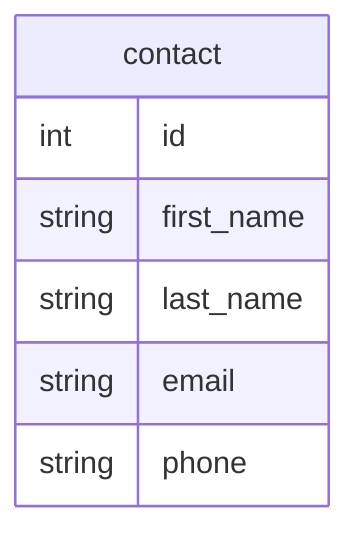

# Exercise 1 - Database 

In this exercise, you will create a database and a table to store data.

## Task 1: Create a Database

Using either phpMyAdmin or the VS Code extension SQLtools alongside SQL statements, create a contact list database. The database will have the following structure:



**Note:**
phpMyAdmin is a web-based tool that allows you to manage MySQL databases. It is pre-installed in the Codespaces environment and can be accessed by navigating to `localhost:8081` in your browser.

**Note:**
SQLtools is a VS Code extension that allows you to explore and interact with databases. It provides a graphical interface to view the database schema and to run SQL queries directly from the editor. It is pre-installed in the Codespaces environment. You can access it by clicking on the SQLtools icon in the sidebar.

### Steps

1. Create a new database named `ContactList`.
2. Create a table named `contact` with the following columns:
   - `id` - an integer that is the primary key and auto-incrementing.
   - `first_name` - a string that is 50 characters long.
   - `last_name` - a string that is 50 characters long.
   - `email` - a string that is 100 characters long.
   - `phone` - a string that is 20 characters long.

**Key SQL concepts:**
- `PRIMARY KEY` uniquely identifies each row in a table. No two rows can share the same primary key value.
- `AUTO_INCREMENT` automatically generates a unique integer value for the `id` column each time a new row is inserted, so you do not need to specify the `id` manually.
- `VARCHAR(n)` stores variable-length strings of up to `n` characters, which is more space-efficient than fixed-length `CHAR(n)`.

Example SQL to create the table:

```sql
CREATE DATABASE ContactList;
USE ContactList;

CREATE TABLE contact (
    id INT AUTO_INCREMENT PRIMARY KEY,
    first_name VARCHAR(50),
    last_name VARCHAR(50),
    email VARCHAR(100),
    phone VARCHAR(20)
);
```


## Task 2: Insert Data

Insert the following data into the `contact` table:

| first_name | last_name | email                 | phone         |
|------------|-----------|-----------------------|---------------|
| John       | Doe       | john.doe@example.com | 123-456-7890  |
| Jane       | Smith     | jane.smith@example.com| 987-654-3210  |
| Alice      | Johnson   | alice.j@example.com  | 555-123-4567  |
| Bob        | Brown     | bob.brown@example.com| 444-987-6543  |
| Charlie    | Davis     | charlie.d@example.com| 333-222-1111  |


## Task 3: Inspect Database Schema

Use either phpMyAdmin or SQLtools to inspect the database schema and verify that the `ContactList` database and `contact` table have been created correctly.
